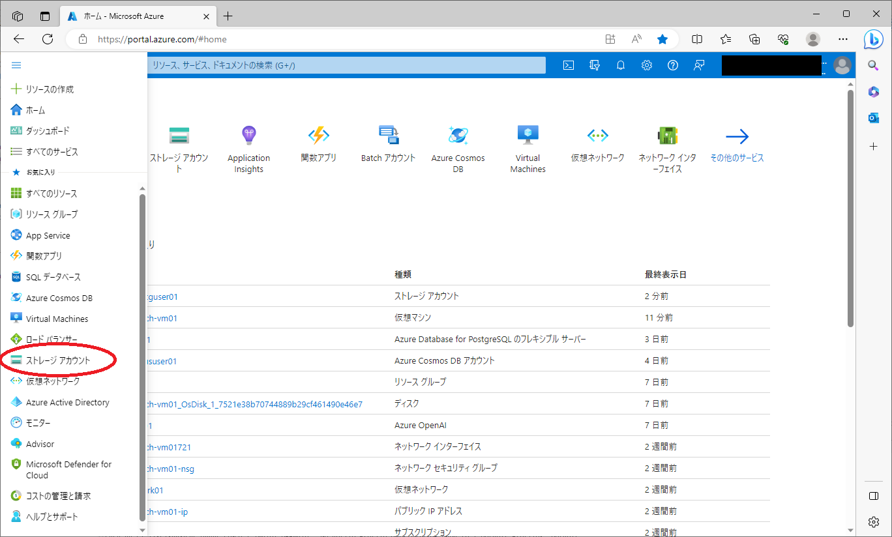
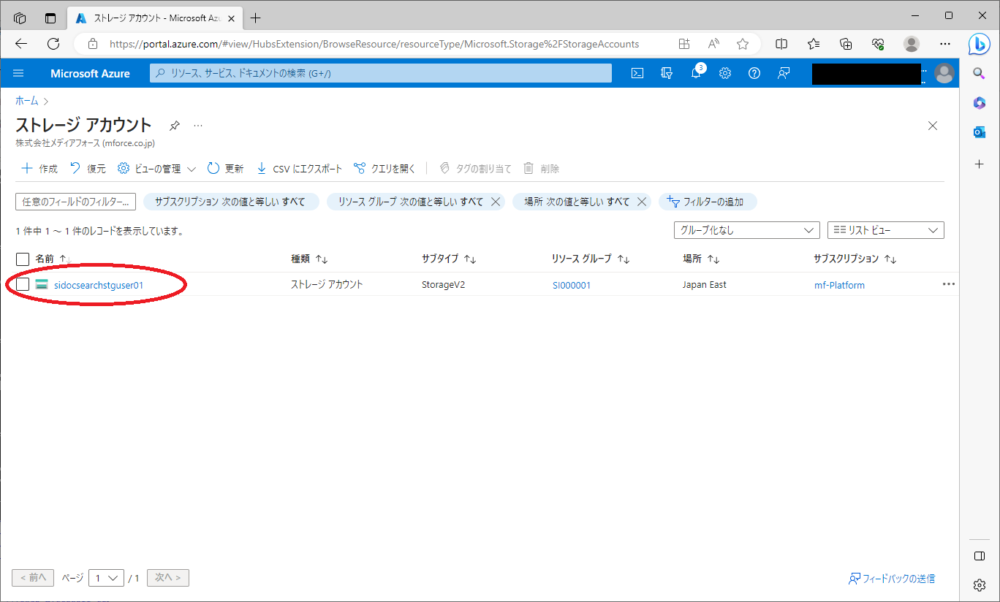
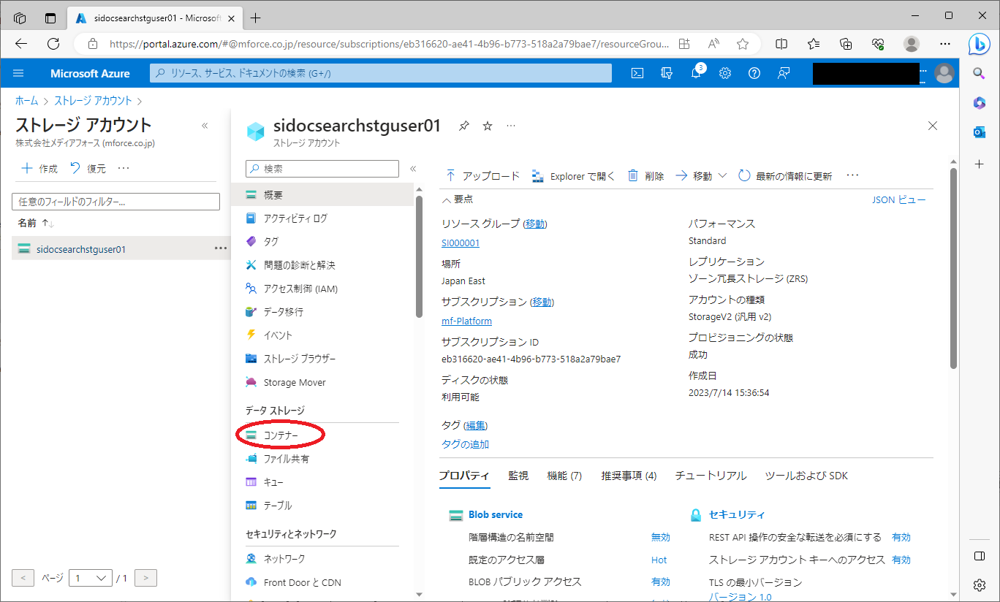
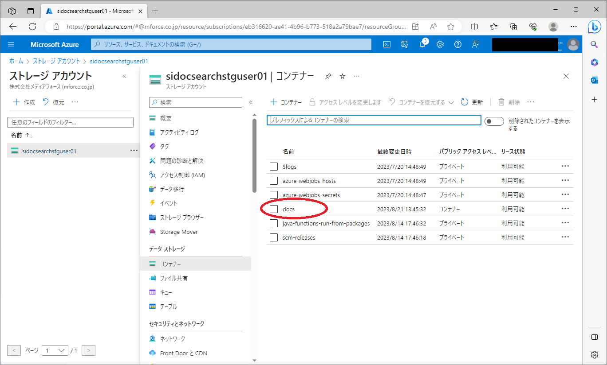
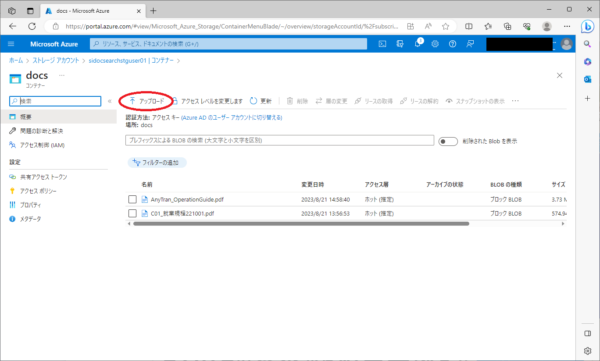
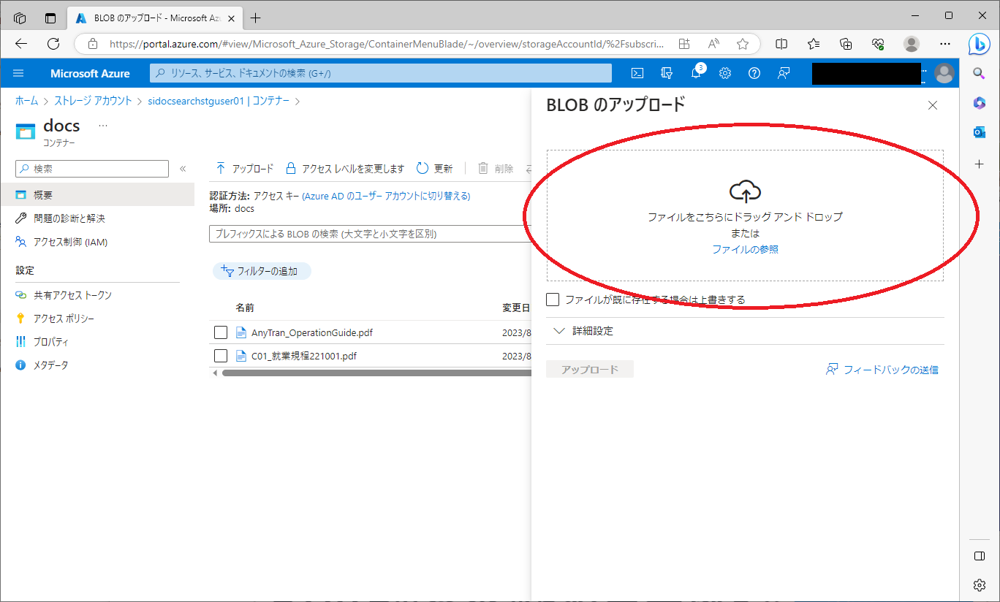
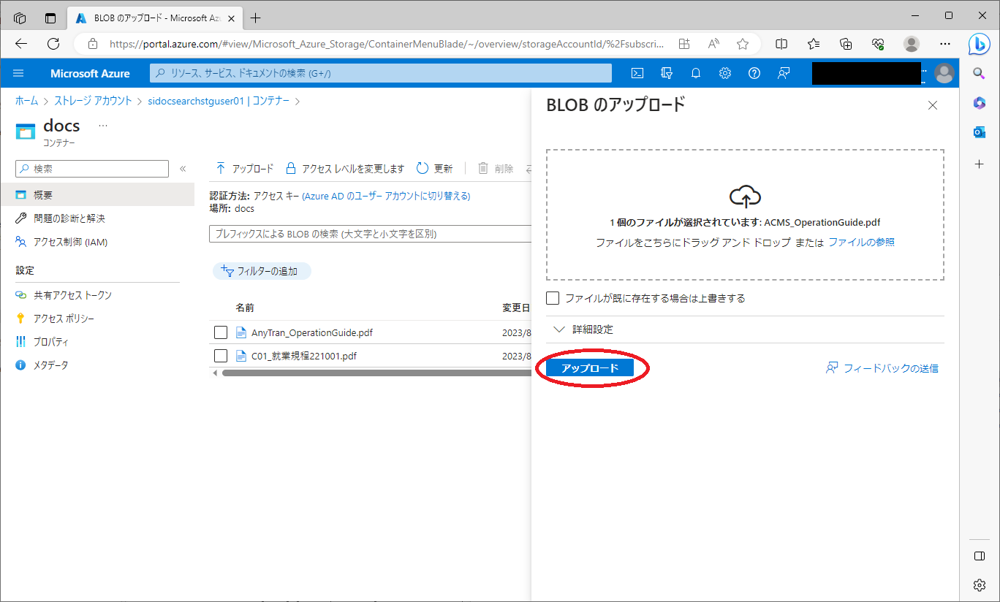

# ドキュメントアップロード手順

## Azureポータルからのアップロード

### ストレージアカウント画面の表示

Azureポータルのメニューからストレージアカウントを選択してください。

### ストレージアカウントの選択

一覧から`sidocsearchstguser01`をクリックして詳細を表示してください。

### コンテナ画面の表示

データストレージのコンテナーを選択してください。

### コンテナの選択

一覧から`docs`をクリックして詳細を表示してください。

### アップロード画面の表示

アップロードを選択してください。

### ファイルのアップロード

ドラックアンドドロップエリアにファイルをドラックアンドドロップしてください。

ファイルをドラックアンドドロップするとアップロードボタンが活性化するので、アップロードボタンをクリックしてアップロードを行ってください。

アップロードが完了するとトリガーが発動しファイルの読み込みを開始します。
